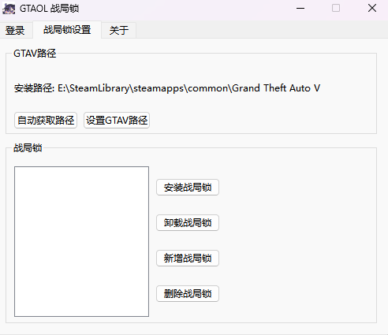

# GTAV战局锁工具

该项目是一个基于PyQt6实现的GTAV线上模式多战局锁切换工具

## 功能列表

- [x] 导入管理本地战局锁
- [x] 快速切换战局锁
- [x] 战局锁采用双密码模式
- [ ] EPIC版本GTAV路径获取
- [ ] 生成并导出战局锁
- [ ] 登录获取账号授权的战局锁

## 界面预览

## 配置文件加密申明

配置文件路径为 `%userprofile%/AppData/Local/Rockstar Games/GTAOL_SMT.dat`

由于后续需要提供登录功能, 为了避免第三方恶意篡改配置文件, 本项目使用了AES加密算法对配置文件进行加密处理

## 版权信息

该项目遵循 MIT 许可证, 但禁止商业用途和销售本软件. 

详细信息请参阅 [LICENSE](LICENSE) 文件
